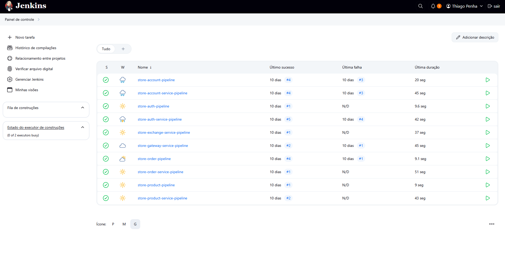

# Detalhes do Projeto - Jenkins Pipeline

## Objetivo

Automatizar o processo de CI/CD dos microserviços da plataforma usando Jenkins.

## Estrutura do Projeto

```
.
├── account
│   └── Jenkinsfile
├── account-service
│   └── Jenkinsfile
├── auth
│   └── Jenkinsfile
├── auth-service
│   └── Jenkinsfile
├── exchange
│   └── Jenkinsfile
├── gateway-service
│   └── Jenkinsfile
├── product-service
│   └── Jenkinsfile
├── product
│   └── Jenkinsfile
├── order
│   └── Jenkinsfile
├── order-service
    └── Jenkinsfile
```

## Arquitetura

Cada microserviço possui um Jenkinsfile próprio que realiza:

- Checkout de dependências (quando necessário)
- Build com Maven
- Build da imagem Docker
- Push da imagem para Docker Hub
- Deploy (implícito via K8s YAMLs)


