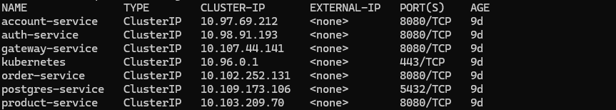
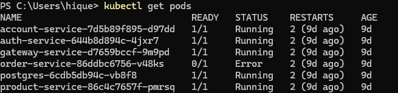

# Detalhes do Projeto - Kubernetes Minikube

## Objetivo

Executar todos os microserviços da plataforma em um único cluster Kubernetes local usando Minikube.

## Estrutura do Projeto

Os manifests estão organizados por microserviço:

```
k8s/
├── account-service/
│   └── k8s.yaml
├── auth-service/
│   └── k8s.yaml
├── gateway-service/
│   └── k8s.yaml
├── product-service/
│   └── k8s.yaml
├── order-service/
│   └── k8s.yaml
```

## Componentes por Microserviço

Cada `k8s.yaml` contém:

- Secret (credenciais, tokens, senhas)
- ConfigMap (variáveis de ambiente)
- Deployment (definição do pod e imagem)
- Service (exposição interna ou externa)

## Resultado



## Exemplo de Comando de Verificação

```bash
minikube start
kubectl get pods -A
kubectl get services
```
