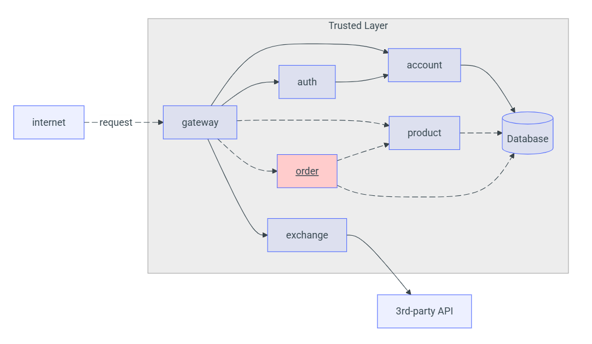

# Detalhes do Projeto - Order API

## Objetivo
Permitir a criação e consulta de pedidos por parte dos usuários autenticados.

## Arquitetura

- A API faz parte da arquitetura de microsserviços da plataforma.
- Comunicação entre Order Service e Product Service para obter detalhes do produto.
- Autenticação via JWT integrada com o Gateway e o Auth Service.
- Armazenamento de pedidos e itens de pedidos no banco de dados PostgreSQL.

```
request → gateway → account/auth → order → product → database
```



## Endpoints

### POST `/order`
Cria um novo pedido para o usuário atual.

**Request:**
```json
{
    "items": [
        { "idProduct": "0195abfb-7074-73a9-9d26-b4b9fbaab0a8", "quantity": 2 },
        { "idProduct": "0195abfe-e416-7052-be3b-27cdaf12a984", "quantity": 1 }
    ]
}
```

---

### GET `/order`
Retorna todos os pedidos do usuário atual.

---

### GET `/order/{id}`
Retorna os detalhes de um pedido. Se não pertencer ao usuário atual, retorna 404.

---

## Tecnologias

- Spring Boot
- Spring Security
- Spring Data JPA
- PostgreSQL
- Swagger (SpringDoc)
- Docker
