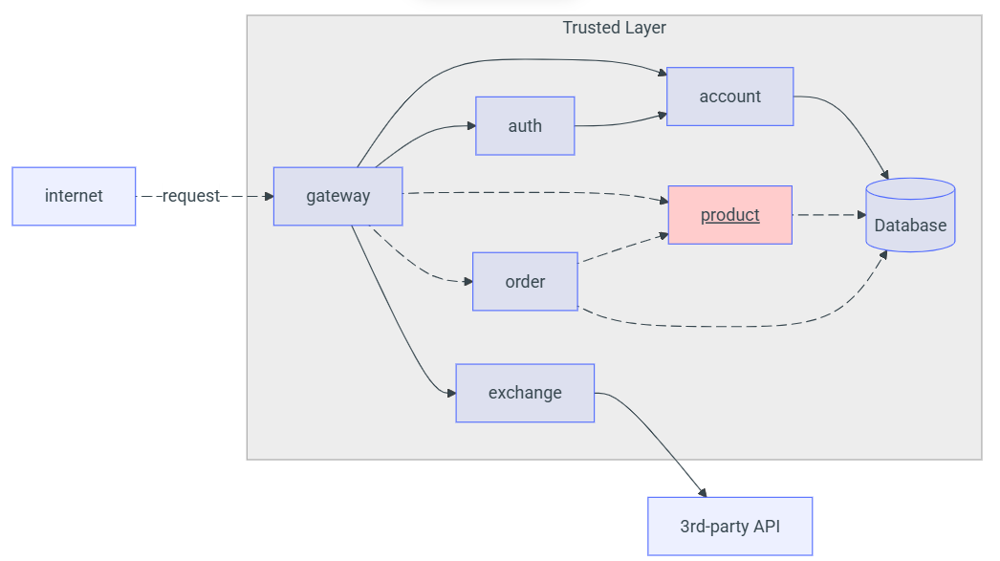

# Detalhes do Projeto - Product API

## Objetivo
Criar uma API RESTful para controle de produtos com autenticação e autorização.

## Arquitetura




## Frameworks Utilizados
- Java 17
- Spring Boot
- Spring Security
- Spring Data JPA
- PostgreSQL
- Lombok
- Swagger (SpringDoc OpenAPI)
- Docker

## Endpoints

### POST `/product`
Cria um novo produto. Requer papel `ADMIN`.

**Request:**
```json
{
  "name": "Tomato",
  "price": 10.12,
  "unit": "kg"
}
```

---

### GET `/product`
Lista todos os produtos.

---

### GET `/product/{id}`
Retorna um produto por ID.

---

### DELETE `/product/{id}`
Remove um produto por ID. Requer papel `ADMIN`.

---

## Extras Implementados

- Busca por nome (`GET /product?name=like`)
- Validação com `@Valid`
- Autenticação JWT via Spring Security
- Controle de acesso por role (`USER`, `ADMIN`)
- Swagger disponível em `/swagger-ui.html`
