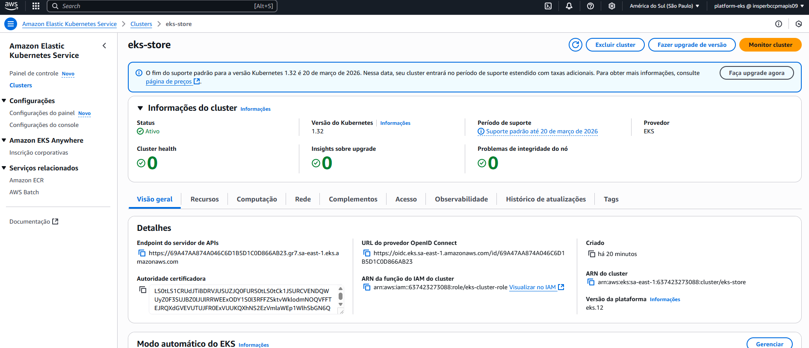
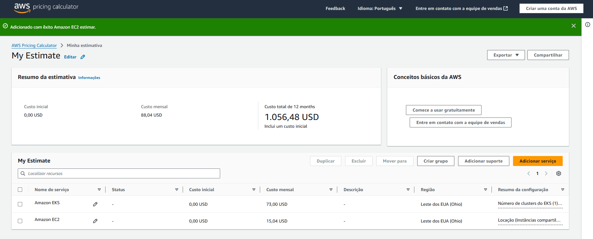
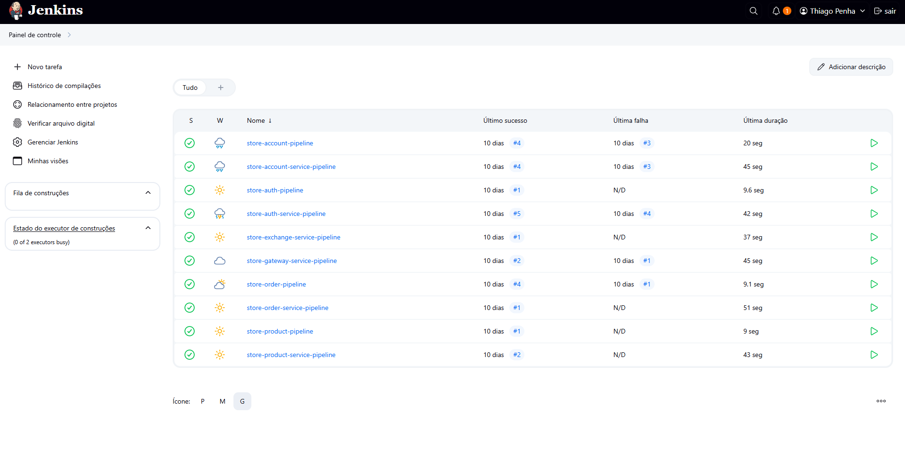

# Projeto em Grupo

## Visão Geral do Projeto

O projeto em grupo tem como objetivo aplicar práticas modernas de desenvolvimento em nuvem, DevOps e microserviços em um ambiente real de produção usando a AWS. As entregas foram organizadas em etapas práticas que abrangem desde a configuração da infraestrutura (AWS e EKS), testes de desempenho (HPA e carga), até o deploy automatizado com Jenkins (CI/CD). Além disso, cada grupo foi responsável por realizar uma análise de custos realista utilizando o AWS Pricing Calculator e calcular o uso de recursos com base em seu cluster. A entrega final inclui não apenas a implantação funcional da aplicação via EKS e banco de dados com RDS, mas também a documentação completa, uma apresentação de storytelling visual e um vídeo de demonstração entre 2 a 3 minutos. O projeto avalia tanto aspectos técnicos quanto de comunicação, destacando desafios enfrentados e práticas de engenharia adotadas, como o uso de PaaS, testes de carga e automatização de pipelines. Cada etapa do projeto contribui para uma formação sólida em arquitetura de sistemas distribuídos, cloud computing e entrega contínua.

## Objetivos

- Configurar a conta AWS para suportar o projeto.
- Provisionar e configurar corretamente o cluster EKS.
- Elaborar um plano de custos realista utilizando o AWS Pricing Calculator.
- Aplicar soluções PaaS para simplificar operações (RDS, EKS, ECR).
- Garantir que todos os microserviços estejam funcionando corretamente no ambiente de produção.

## Arquitetura

- **API Gateway**: Controla entrada e roteamento.
- **Auth**: Serviço de autenticação com JWT.
- **Exchange, Product, Order, Account**: serviços de domínio.
- **PostgreSQL**: banco de dados usado pelos serviços.

## Fluxo de requisição

1. Login no Auth → recebe token JWT  
2. Token usado no Gateway para acessar rotas protegidas  
3. Gateway redireciona para Account, Order ou Product  

## Deploy

- **Minikube**: usado em testes locais  
- **EKS**: usado na apresentação final  

---

> Toda a infraestrutura foi gerenciada com `kubectl`, arquivos YAML e Helm quando aplicável.

---

## Configuração AWS e EKS

Durante este projeto, nós configuramos a conta AWS e provisionamos um cluster EKS. Abaixo, uma captura de tela do cluster em execução:

Este cluster foi configurado para escalar automaticamente conforme a demanda usando Auto Scaling Groups e HPA.

**Endpoint da API em execução:**  

http://aef1f8f294b95439283d49dcde0dbde5-1733067101.sa-east-1.elb.amazonaws.com

---

## Análise de Custos

Utilizamos o AWS Pricing Calculator para gerar um plano de custo que reflete o uso estimado dos recursos no EKS:

A projeção acima demonstra os custos mensais esperados para manter o ambiente dormindo e em uso.

---

## CI/CD

Jenkins do site com deploy : 

---

## PaaS

A plataforma como serviço (PaaS) é um modelo de computação em nuvem que fornece uma plataforma para desenvolver, executar e gerenciar aplicativos sem a complexidade de construir e manter a infraestrutura normalmente associada ao desenvolvimento e lançamento de aplicativos.

Durante o desenvolvimento, empregamos diversos serviços PaaS da AWS de múltiplas maneiras:

1. *Amazon Relational Database Service (RDS)*
2. O banco de dados PostgreSQL foi administrado através do RDS, removendo a obrigatoriedade de estabelecer e sustentar servidores dedicados para base de dados.
3. Definimos configurações de backup e disponibilidade elevada diretamente pelo painel do RDS, assegurando a permanência e resistência das informações.
4. *Amazon Elastic Kubernetes Service (EKS)*
5. Apesar do EKS ser classificado como um serviço administrado de Kubernetes (denominado Kubernetes como serviço), ele também se adequa ao modelo PaaS uma vez que a AWS administra o painel de controle do cluster.
6. Empregamos o EKS para coordenar os microserviços sem necessidade de provisionar a instância do painel principal nem administrar atualizações de versão do Kubernetes de forma manual.
7. *Amazon Elastic Container Registry (ECR)*
8. Ao invés de manter um repositório Docker local ou auto-gerenciado, empregamos o ECR para controlar versões e guardar as imagens dos microserviços.
9. Os pipelines do Jenkins executam o push das imagens diretamente ao ECR, que disponibiliza integração nativa com o EKS.
10. Através do ECR, dispensamos a configuração de servidores adicionais para registros de container.

Estas opções de PaaS diminuíram a sobrecarga operacional e possibilitaram que concentrássemos esforços na programação, supervisão e expansibilidade do cluster EKS.

---

## Vídeo de Demonstração

A seguir, nosso vídeo de demonstração, mostrando o projeto em funcionamento:

https://youtu.be/NFAGbPZ6OfY
