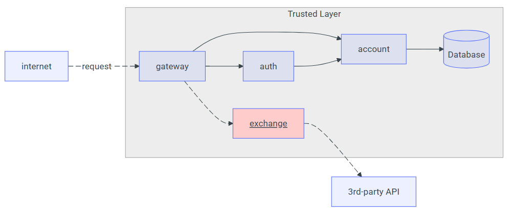

# Detalhes do Projeto

## Objetivo
Criar uma API REST usando FastAPI que permita a conversão entre moedas, utilizando dados de terceiros, autenticação e gateway.

## Arquitetura



## Endpoint

### `GET /exchange/{from}/{to}`
Retorna as taxas de câmbio entre duas moedas.

Exemplo: `/exchange/USD/EUR`

**Resposta:**
```json
{
  "from": "USD",
  "to": "EUR",
  "sell": "0.82",
  "buy": "0.80",
  "date": "2021-09-01 14:23:42"
}
```
